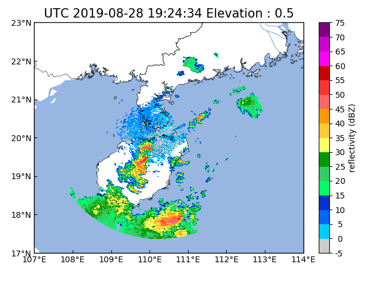

# pycwr (Python China Weather Radar tools libaray)

- [README in Chinese](README_CN.md)
- [Developers and contributors](CONTRIBUTORS.txt)

Project development plan
----------

- [x] WSR98D, CINRAD/SA/SB/CB, CINRAD/CC/CCJ, CINRAD/SC/CD support
- [ ] Cfradial Read support
- [x] Write to Cfradial support
- [x] Automatically identify radar and obtain latitude and longitude information (SA/SB/CB)
- [x] Automatic recognition of radar data format types
- [x] transform to Pyart Radar object
- [x] Graphical interface support
- [x] Radar vertical profile support
- [x] Interpolation algorithm support
- [x] PPI drawing support, overlay map support
- [ ] RHI drawing support
- [ ] Multi-radar inversion algorithm support
- [ ] Radar product algorithm support
- [ ] Doppler Radar/Dual polarization radar quality control algorithm
- [ ] DSD Algorithm Support for Dual Polarization Radar
- [ ] Doppler radar wind field retrieve support
- [ ] Radar quantitative precipitation estimation algorithm support
- [ ] Radar extrapolation algorithm support
- [ ] Radar quantitative precipitation forecast  algorithm support

Install pycwr Library
----------

```
git clone https://github.com/YvZheng/pycwr.git
cd pycwr
python setup.py install    
```

Read Radar Basedata to PRD (Polarimetry Radar Data) class or Py-ART Radar class
----------
```
from pycwr.io.auto_io import radar_io 
file = r"./Z_RADR_I_Z9898_20190828192401_O_DOR_SAD_CAP_FMT.bin.bz2"
data = radar_io(file)
PRD = data.ToPRD()
PyartRadar = data.ToPyartRadar()
```
The data structure of the PRD is as follows:


Plotting Radar Data with map
----------
```
from pycwr.draw.SingleRadarPlotMap import RadarGraphMap
graph = RadarGraphMap(PRD)
graph.plot(0, "dBZ")
plt.show()
```
As illustrated in the picture below:



Launch Graphical interface to show Radar Data
----------

```
 python scripts/LaunchGUI.py
```

The main window opens as shown below:


more example via: [exmaple](./notebooks/NuistRadar_example.ipynb)

Developers and Contributors
----------

Yu Zheng - Nanjing University of Information Science and Technology, School of Atmospheric Physics

Nan Li - Nanjing University of Information Science and Technology, School of Atmospheric Physics

Wei Ming - Nanjing University of Information Science and Technology, School of Atmospheric Physics

Zhigang Chu - Nanjing University of Information Science and Technology, School of Atmospheric Physics

Sihui Fan - Nanjing University of Information Science and Technology, School of Atmospheric Physics

Pengcheng Jia - Nanjing University of Information Science and Technology, School of Atmospheric Physics

Yang Li - Nanjing University of Information Science and Technology, School of Atmospheric Physics

Xin Zhang  - Nanjing University of Information Science and Technology, School of Atmospheric Physics


