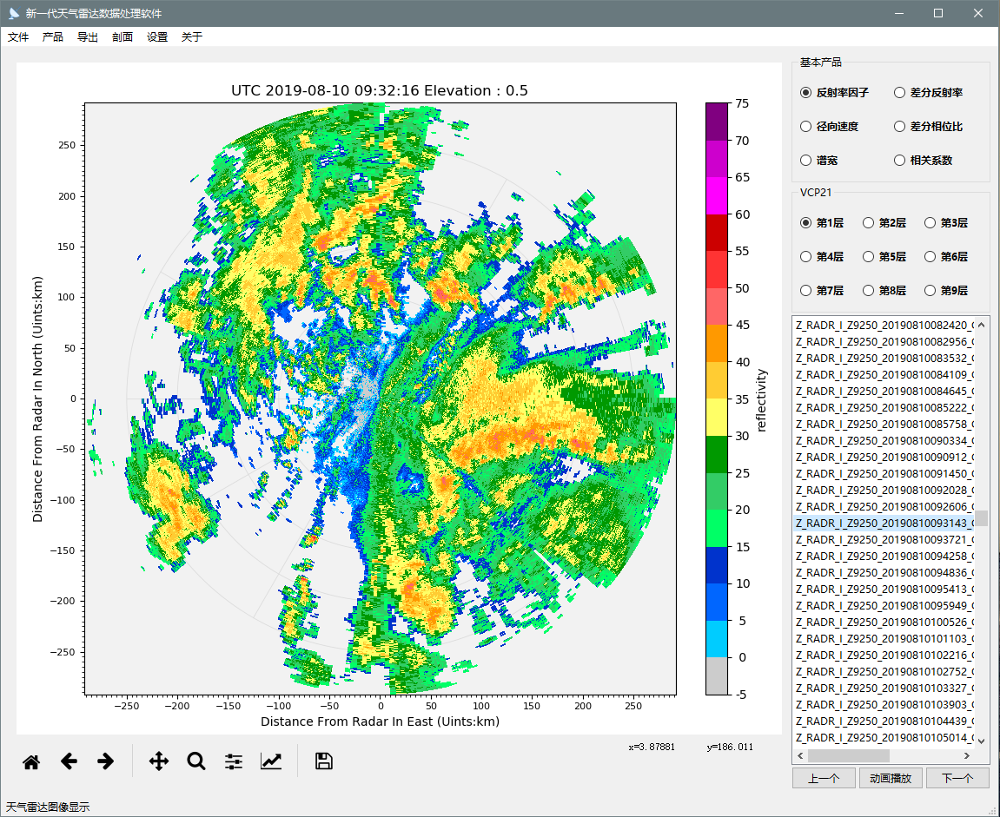

# NuistRadar 

- [README in Chinese](README_CN.md)
- [Developers and contributors](CONTRIBUTORS.txt)

## Project development plan

- [x] WSR98D, CINRAD/SA/SB/CB, CINRAD/CC/CCJ, CINRAD/SC/CD support
- [ ] Cfradial Read support
- [ ] Write to Cfradial support
- [x] Automatically identify radar and obtain latitude and longitude information (SA/SB/CB)
- [x] Automatic recognition of radar data format types
- [x] transform to Pyart Radar object
- [x] Graphical interface support
- [x] Radar vertical profile support
- [x] Interpolation algorithm support
- [x] PPI drawing support, overlay map support
- [ ] RHI drawing support
- [ ] Multi-radar inversion algorithm support
- [ ] Radar product algorithm support
- [ ] Doppler Radar/Dual polarization radar quality control algorithm
- [ ] DSD Algorithm Support for Dual Polarization Radar
- [ ] Doppler radar wind field retrieve support
- [ ] Radar quantitative precipitation estimation algorithm support
- [ ] Radar extrapolation algorithm support
- [ ] Radar quantitative precipitation forecast  algorithm support

## Install NuistRadar Library

```
git clone https://github.com/YvZheng/NuistRadar.git
cd NuistRadar
python setup.py install    
```

## Launch Graphical interface to show Radar Data

```
 python scripts/LaunchGUI.py
```

The main window opens as shown below:




