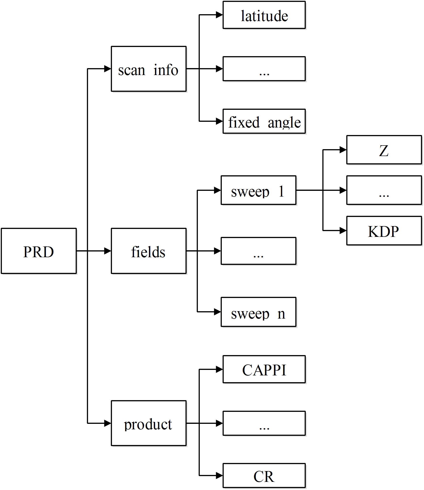
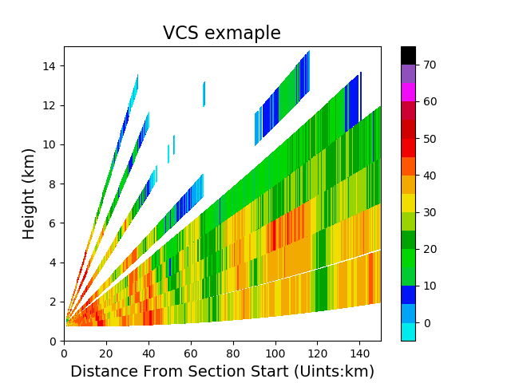
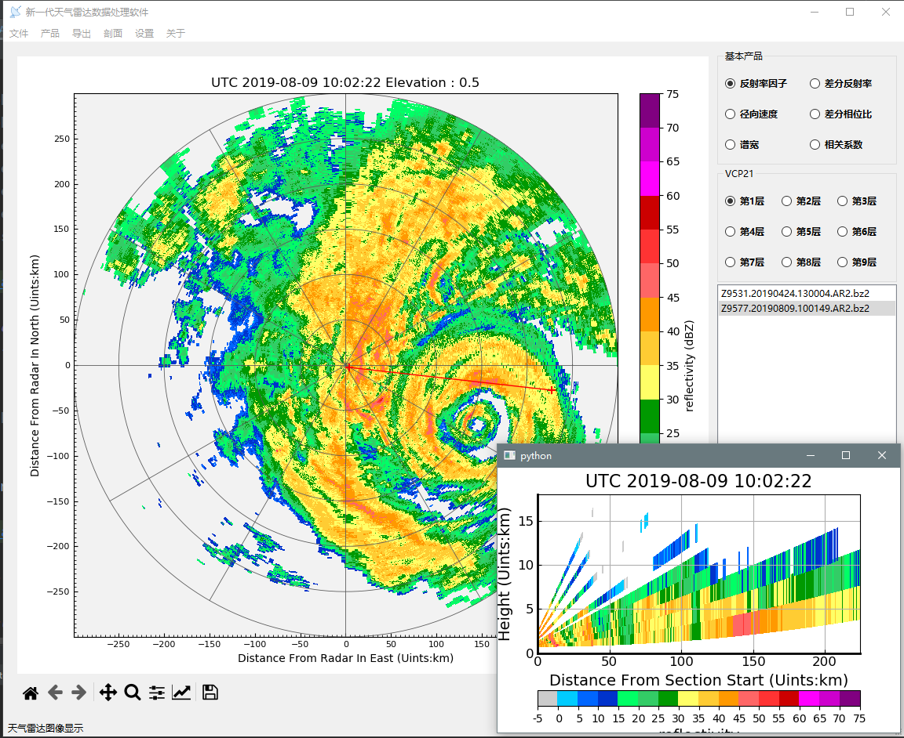

<div align=center>


</div>

# pycwr (Python China Weather Radar tools library)

- [中文](README_CN.md)
- [Developers and contributors](CONTRIBUTORS.txt)

Install pycwr Library
----------
### The easiest route to installing pycwr is through pip and conda:

if you haven't install cartopy, for all platforms installing cartopy can be done with:

```
conda install -c conda-forge cartopy
```
and you can install pycwr with pip:
```
pip install pycwr
```

### Also, you can install from source code:

```
git clone https://github.com/YvZheng/pycwr.git
cd pycwr
python setup.py install    
```

Read Radar Basedata to PRD (Polarimetry Radar Data) class or Py-ART Radar class
----------
```
from pycwr.io import read_auto
file = r"./Z_RADR_I_Z9898_20190828192401_O_DOR_SAD_CAP_FMT.bin.bz2"
PRD = read_auto(file)
PyartRadar = PRD.ToPyartRadar()
```
The data structure of the PRD is as follows:



Plotting PPI with map
----------
```
import matplotlib.pyplot as plt
import cartopy.crs as ccrs
from pycwr.draw.RadarPlot import Graph, GraphMap
ax = plt.axes(projection=ccrs.PlateCarree())
graph = GraphMap(PRD, ccrs.PlateCarree())
graph.plot_ppi_map(ax, 0, "dBZ", cmap="pyart_NWSRef")
ax.set_title("example of PPI with map", fontsize=16)
plt.show()
```


Plotting PPI
----------
```
fig, ax = plt.subplots()
graph = Graph(PRD)
graph.plot_ppi(ax, 0, "dBZ", cmap="pyart_NWSRef")
graph.add_rings(ax, [0, 50, 100, 150, 200, 250, 300])
ax.set_title("example of PPI", fontsize=16)
ax.set_xlabel("Distance From Radar In East (km)", fontsize=14)
ax.set_ylabel("Distance From Radar In North (km)", fontsize=14)
```


Plotting VCS with lat lon position
----------
```
fig, ax = plt.subplots()
graph = GraphMap(PRD, ccrs.PlateCarree())
graph.plot_vcs_map(ax, (120.8, 27.8), (122.9, 26.8), "dBZ", cmap="pyart_NWSRef")
ax.set_ylim([0,15])
ax.set_ylabel("Height (km)", fontsize=14)
ax.set_xlabel("Latitude, Longitude", fontsize=14)
ax.set_title("VCS exmaple", fontsize=16)
plt.show()
```


Plotting VCS with x y position
----------
```
fig, ax = plt.subplots()
graph = Graph(PRD)
graph.plot_vcs(ax, (0,0), (150, 0), "dBZ", cmap="pyart_NWSRef")
ax.set_ylim([0,15])
ax.set_ylabel("Height (km)", fontsize=14)
ax.set_xlabel("Distance From Section Start (Uints:km)", fontsize=14)
ax.set_title("VCS exmaple", fontsize=16)
plt.show()
```


Launch Graphical interface to show Radar Data
----------

```
 python scripts/LaunchGUI.py
```

The main window opens as shown below:



more example via: [exmaple](./notebooks/pycwr_example.ipynb)


Project development plan
----------

- [x] WSR98D, CINRAD/SA/SB/CB, CINRAD/CC/CCJ, CINRAD/SC/CD support
- [ ] Cfradial Read support
- [x] Write to Cfradial support
- [x] Automatically identify radar and obtain latitude and longitude information (SA/SB/CB)
- [x] Automatic recognition of radar data format types
- [x] transform to Pyart Radar object
- [x] Graphical interface support
- [x] Radar vertical profile support
- [x] Interpolation algorithm support
- [x] PPI drawing support, overlay map support
- [ ] RHI drawing support
- [ ] Multi-radar inversion algorithm support
- [x] Radar product algorithm support
- [ ] Doppler Radar/Dual polarization radar quality control algorithm
- [ ] DSD Algorithm Support for Dual Polarization Radar
- [x] Doppler radar wind field retrieve support
- [ ] Radar quantitative precipitation estimation algorithm support
- [ ] Radar extrapolation algorithm support
- [ ] Radar quantitative precipitation forecast  algorithm support
