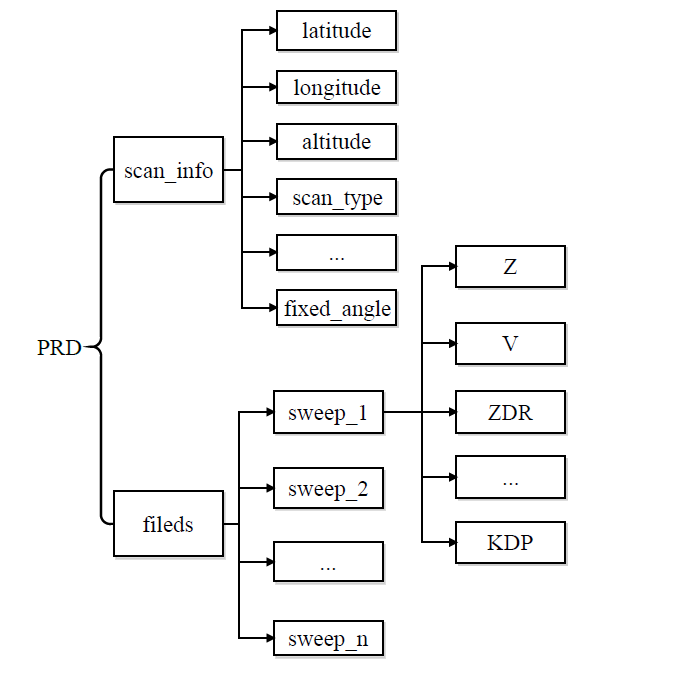

# 中国天气雷达开源库

- [英文版](README.md)
- [开发人员](CONTRIBUTORS.txt)

项目开发计划
----------

- [x] 国内WSR98D, CINRAD/SA/SB/CB, CINRAD/CC/CCJ, CINRAD/SC/CD支持
- [ ] Cfradial读取支持(不借助pyart)
- [x] NuistRadar类导出为Cfradial格式支持
- [x] 自动识别雷达站点并获取经纬度信息(针对SA/SB/CB)
- [x] 自动识别雷达数据格式类型
- [x] 转换为Pyart Radar类
- [x] 图形化界面支持
- [x] 垂直剖面支持
- [x] 雷达插值算法支持
- [x] PPI绘图支持, 叠加地图支持
- [ ] RHI绘图支持
- [ ] 多雷达反演算法支持
- [ ] 雷达数据产品生成算法支持
- [ ] 多普勒雷达/双偏振雷达质控算法
- [ ] 双偏振雷达雨滴谱反演算法支持
- [ ] 多普勒雷达风场反演支持
- [ ] 雷达定量估测降水算法支持
- [ ] 雷达回波外推算法支持
- [ ] 雷达定量预报降水算法支持

安装pycwr库
----------

```
git clone https://github.com/YvZheng/pycwr.git
cd pycwr
python setup.py install    
```

读取雷达数据 PRD类或者Py-ART的Radar类
----------
```
from pycwr.io.auto_io import radar_io 
file = r"E:\RadarBaseData\CINRAD-SA\温州\2015080816.59A"
data = radar_io(file)
PRD = data.ToPRD()
PyartRadar = data.ToPyartRadar()
```
PRD类的数据结构如下:



启动图形化界面
----------

```
 python scripts/LaunchGUI.py
```

主窗口如下图所示:


更多个例参见[NuistRadar例子](./notebooks/NuistRadar_example.ipynb)

开发者
----------

郑玉 - 南京信息工程大学, 大气物理学院

李南 - 南京信息工程大学, 大气物理学院

魏鸣 - 南京信息工程大学, 大气物理学院

楚志刚 - 南京信息工程大学, 大气物理学院

樊思慧 - 南京信息工程大学, 大气物理学院

贾鹏程 - 南京信息工程大学, 大气物理学院

贡献者
------------

李杨 - 南京信息工程大学, 大气物理学院

张昕 - 南京信息工程大学, 大气物理学院

